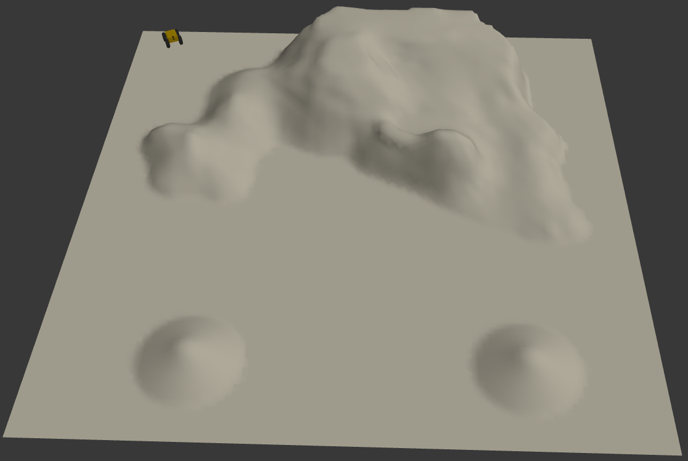
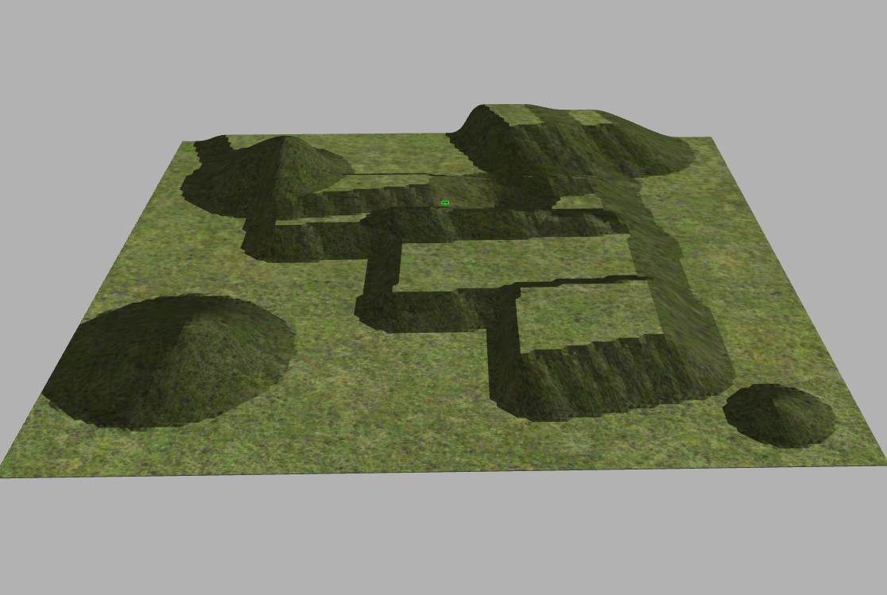
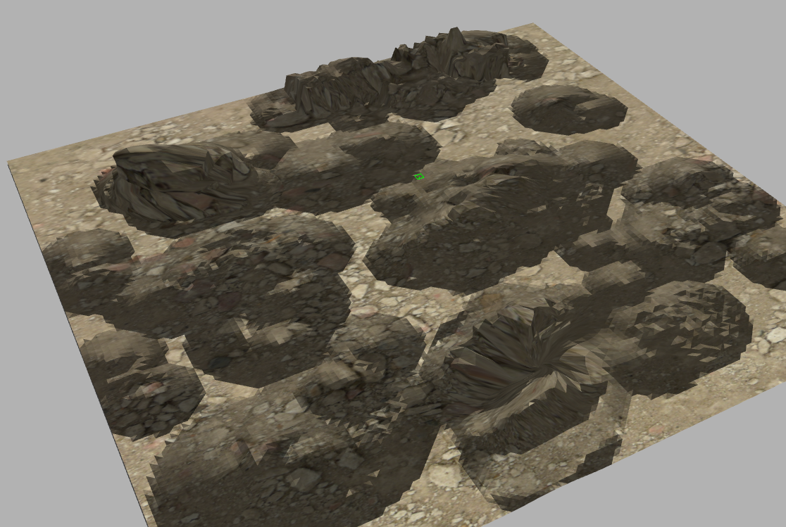
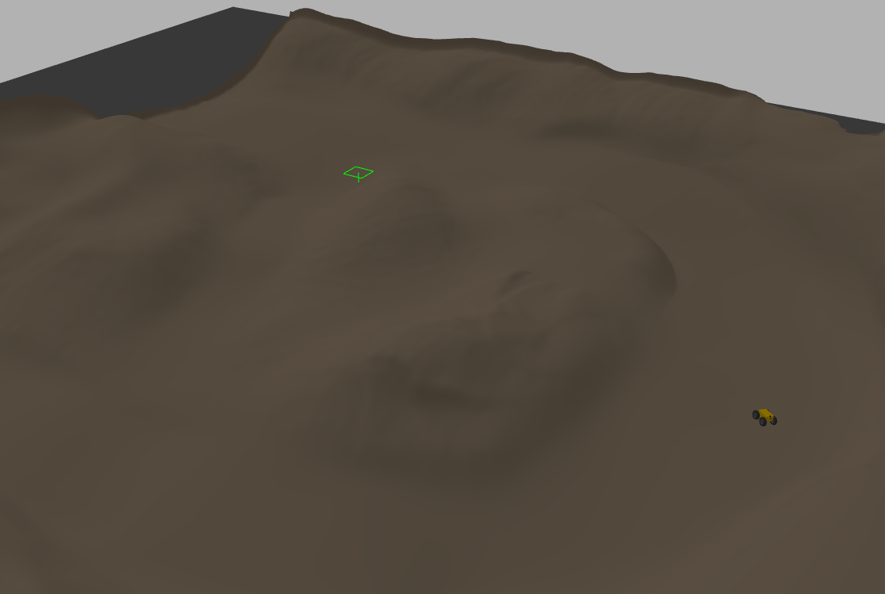
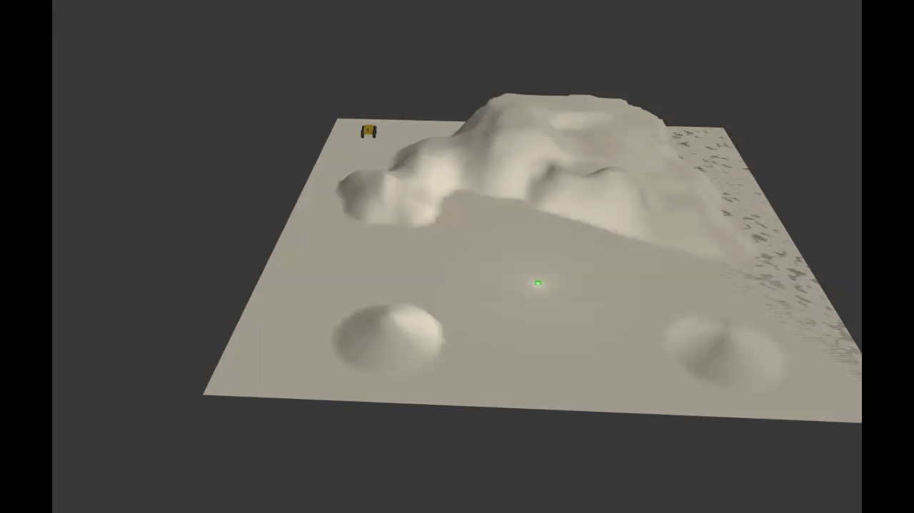
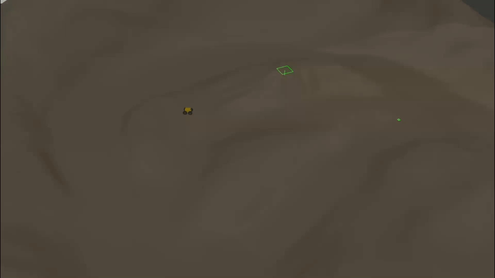
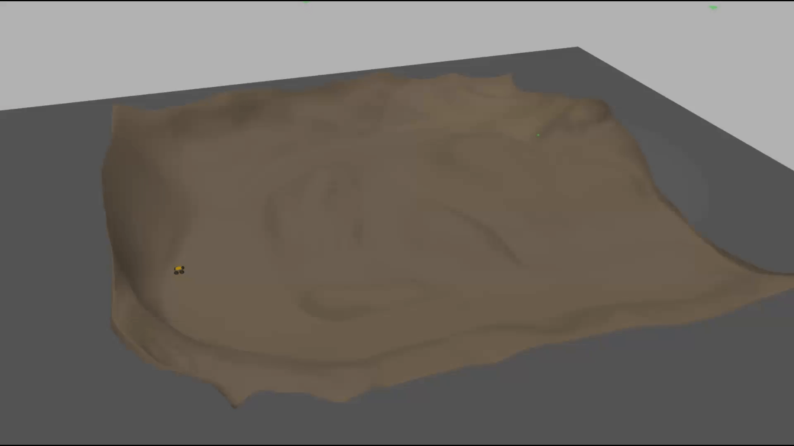
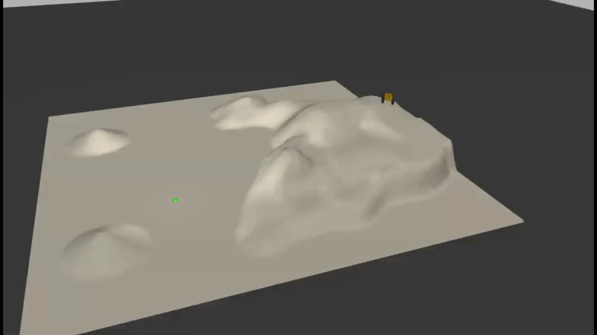

# Agoraphilic* robot path planning algorithm
Agoraphilic* is an advanced robot path planning algorithm designed for 2.5D environments, extending the free space force concept of the traditional Agoraphilic algorithm to enable navigation in uneven terrain. It introduces a structured approach for free space identification and terrain-aware navigation.

# Simulation Environment  
This code was tested on Ubuntu 22.04 with ROS 2 Humble, Gazebo 11.10.2, and Python 3.10.12.

## Simulation Environment Models  
The simulation environment models and are located in the [gazebo models ](/gazebo%20models/) folder. Copy the models to the `.gazebo/models` directory. The skid robot platform model used for testing is located in the [gazebo models/robot](/gazebo%20models/robot/) folder. This robot platform includes a simulated depth camera.

  
  

  
  

## Agoraphilic* Algorithm Script  
The Agoraphilic* algorithm script is located in the [script](/scripts/) folder.  
Modify the initial parameters in the `initParameters()` function to match the environment and robot platform.

## Simulations

  
  

  
  

  
  

